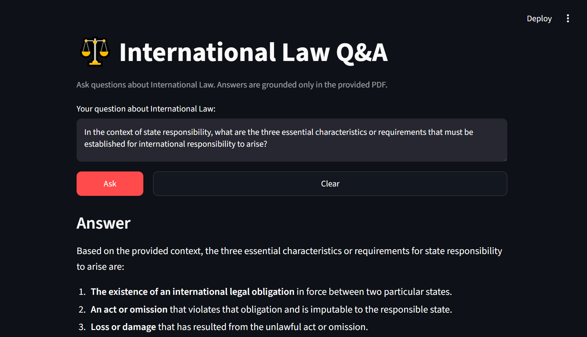
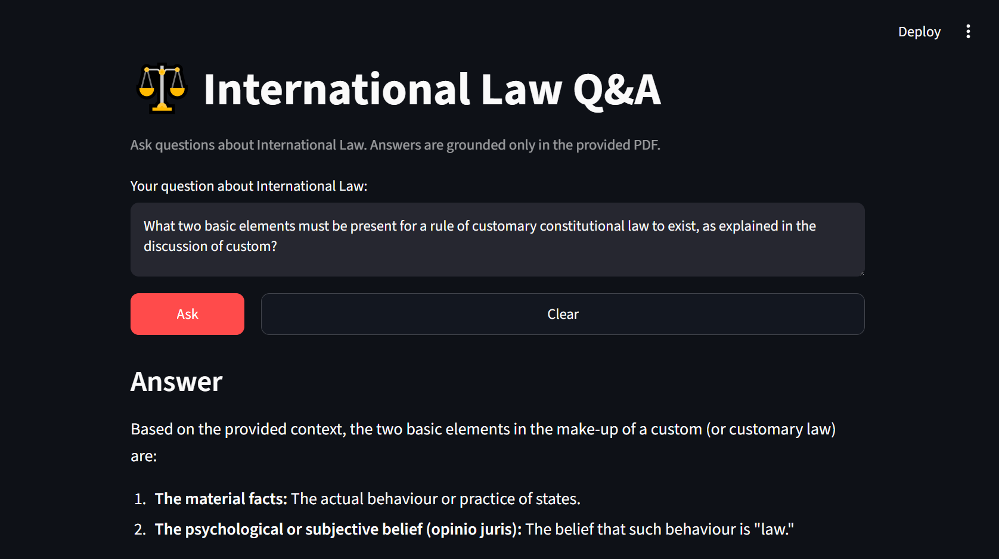
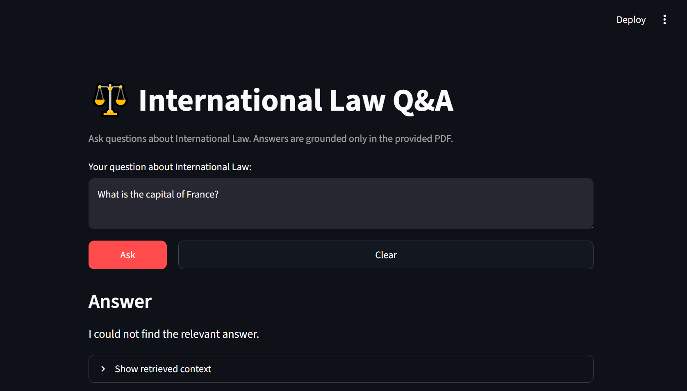

# ⚖️ International Law RAG Assistant

A Retrieval-Augmented Generation (RAG) application that answers questions about International Law using information retrieved from a provided PDF document.

The project combines **LangChain, ChromaDB, Hugging Face embeddings, Google Gemini, and Streamlit** to build a simple end-to-end RAG pipeline.

## 🚀 Demo

The application provides a simple Streamlit interface where users can:

* Ask questions about International Law
* Retrieve relevant information from the source document
* Generate answers using Google Gemini
* View the retrieved context used to generate an answer



## 🧠 How It Works

The application follows a basic RAG pipeline:

```text
International Law PDF
        ↓
   PDF Loader
        ↓
   Text Splitting
        ↓
   Hugging Face Embeddings
        ↓
     ChromaDB
        ↓
   MMR Retrieval
        ↓
   Relevant Context
        ↓
   Prompt + Question
        ↓
      Gemini
        ↓
      Answer
```

Instead of asking the LLM to answer entirely from its internal knowledge, the application first retrieves relevant information from the document and provides that context to the model.

## 🛠️ Technologies Used

* **Python**
* **LangChain**
* **Google Gemini**
* **ChromaDB**
* **Hugging Face Embeddings**
* **Sentence Transformers**
* **Streamlit**
* **PyPDF**
* **python-dotenv**

## 🔍 RAG Configuration

### Document Processing

The PDF is loaded using `PyPDFLoader`.

The extracted content is divided into smaller chunks using:

```python
RecursiveCharacterTextSplitter(
    chunk_size=1000,
    chunk_overlap=200
)
```

This allows the retrieval system to work with manageable pieces of the document.

### Embeddings

The project uses:

```text
BAAI/bge-small-en-v1.5
```

through Hugging Face embeddings.

The embedding model converts document chunks into vectors that can be searched based on semantic similarity.



### Vector Database

The generated embeddings are stored in:

```text
ChromaDB
```

The vector database allows the application to retrieve relevant chunks when a user asks a question.

### Retriever

The project uses **Maximum Marginal Relevance (MMR)** retrieval:

```python
search_type="mmr"

search_kwargs={
    "k": 3,
    "fetch_k": 10,
    "lambda_mult": 0.5
}
```

MMR helps retrieve relevant information while reducing unnecessary similarity between the retrieved chunks.

### LLM

The project uses Google's Gemini model through LangChain:

```text
gemini-3.6-flash
```

The model receives the retrieved context along with the user's question.

## 🛡️ Reducing Hallucinations

The system prompt instructs the model to use only the retrieved context.

If the answer cannot be found in the provided context, the model is instructed to respond:

```text
I could not find the relevant answer
```

This makes the application more grounded in the source document instead of encouraging the model to generate unsupported information.

## 💻 Project Structure

```text
International-Law-RAG-Assistant/
│
├── app.py                 # Streamlit application
├── main.py                # Command-line RAG application
├── database.py            # PDF loading, chunking and vector database creation
├── embedmodel.py          # Hugging Face embedding configuration
├── requirements.txt       # Python dependencies
├── .gitignore
└── README.md
```

The following files/directories are intentionally excluded from the repository:

```text
.env
.venv/
chroma_db/
```



## ⚙️ Installation

### 1. Clone the repository

```bash
git clone https://github.com/realdawood/International-Law-RAG-Assistant.git
```

```bash
cd International-Law-RAG-Assistant
```

### 2. Create a virtual environment

```bash
python -m venv .venv
```

Activate it on Windows:

```bash
.venv\Scripts\activate
```

### 3. Install dependencies

```bash
pip install -r requirements.txt
```

### 4. Add your API key

Create a `.env` file in the project root:

```env
GOOGLE_API_KEY=your_google_api_key_here
```

Do not commit the `.env` file to GitHub.

## 📄 Add the Source Document

Place the International Law PDF in the project root with the expected filename:

```text
international-law_compress.pdf
```

Then run:

```bash
python database.py
```

This will:

1. Load the PDF
2. Extract the document content
3. Split the content into chunks
4. Generate embeddings
5. Store the vectors in ChromaDB

## ▶️ Run the Application

### Streamlit Interface

Run:

```bash
streamlit run app.py
```

The application will open in your browser.

### Command Line Version

You can also run:

```bash
python main.py
```

You will then be able to enter an International Law question directly in the terminal.

## 📌 Example Questions

```text
What are the main sources of international law?

What are the requirements for state responsibility?

What is meant by an international legal obligation?

What constitutes a violation of an international obligation?
```

## 🎯 What I Learned

This project helped me understand the practical workflow behind Retrieval-Augmented Generation.

Key concepts I worked with include:

* Loading and processing documents
* Text chunking
* Embeddings
* Vector databases
* Semantic retrieval
* Maximum Marginal Relevance (MMR)
* Prompt construction
* LLM integration
* Grounding LLM responses with retrieved context
* Building a simple RAG interface with Streamlit

## 🔮 Future Improvements

Some improvements I would like to make in future versions:

* Add source/page citations to answers
* Improve document processing
* Experiment with different embedding models
* Compare different retrieval strategies
* Add conversation history
* Add document upload functionality
* Add multiple-document support
* Improve the UI
* Add evaluation metrics for retrieval and answer quality
* Deploy the application

## ⚠️ Disclaimer

This project is an educational RAG implementation and should not be considered a source of legal advice.

The assistant is designed to answer questions based on the information available in its provided source document.

## 👨‍💻 Author

**Dawood**

Built as my first hands-on Retrieval-Augmented Generation project while learning Generative AI and AI Engineering.

---

⭐ If you find this project useful, consider giving the repository a star.
